# Отчёт по отладке приложения Липкина Григория Михайловича

# Ошибка 1
## Часть 1, связанная с Podman
### Действия
```bash
podman-compose up --build
```

Состояние на момент действий:
```
commit 3e85d42
```

### Проблема
Podman: postgres:16 не существует.
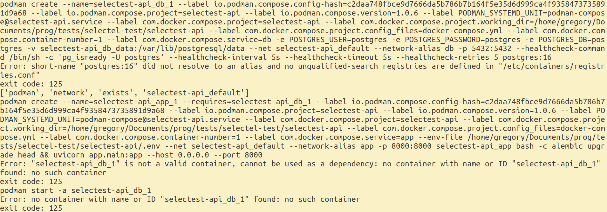

### Решение
`postgres:16` было заменено в `docker-compose.yml` на `docker.io/postgres:16`

## Часть 1, связанная с портами
### Предусловия

Наличие установленной Postgresql на хост-оборудовании.
Достаточно распространено, чтобы считать неучтение этого фактора ошибкой.

### Действия
```bash
podman-compose up --build
```

Состояние на момент действий:
```
commit 3e85d42
```

с изменениями, внесёнными в пункте 1.1 (ошибка 1, часть 1).

### Проблема
Podman/Docker: Невозможно захватить порт 5432: порт занят.
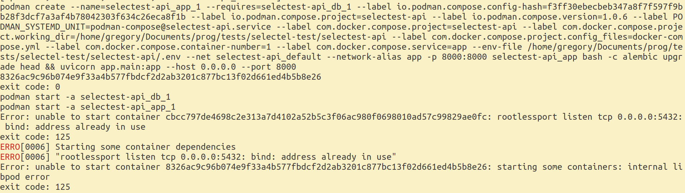

### Решение

Занятый порт `5432` был заменён на `5438`.

# Ошибка 2: опечатка в core/config

Состояние:
```
commit 9e57507
```

## Действия
```bash
podman-compose up --build
```

## Проблема
Дополнительные входные данные не разрешены (Pydantic).
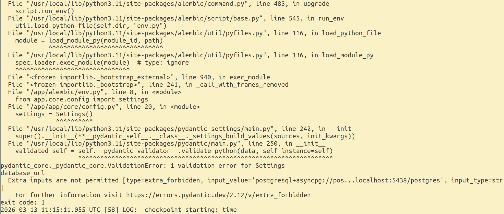

## Решение

Было выяснено, что присутствует опечатка в названии переменной среды, из-за которой значение не было правильно выделено из среды. Также была опечатка в значении по умолчанию.
После исправления опечаток ошибка была устранена.

# Ошибка 3: непроверка наличия city в services/parser::parse_and_store

Состояние:
```
commit 72ba568
```

## Действия
```bash
podman-compose up --build
```

## Проблема
Ошибка: нет поля `name` у объекта типа `NoneType`.
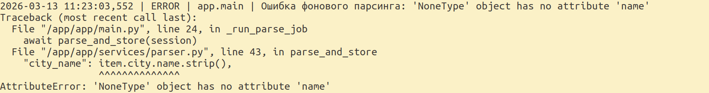

## Решение

Была добавлена проверка на наличие поля `city`, как показывает следующий diff:

```diff
--- a/selectest-api/app/services/parser.py
+++ b/selectest-api/app/services/parser.py
@@ -34,18 +34,20 @@ async def parse_and_store(session: AsyncSession) -> int:
-                parsed_payloads.append(
-                    {
+                city_value = {
                         "external_id": item.id,
                         "title": item.title,
                         "timetable_mode_name": item.timetable_mode.name,
                         "tag_name": item.tag.name,
-                        "city_name": item.city.name.strip(),
                         "published_at": item.published_at,
                         "is_remote_available": item.is_remote_available,
                         "is_hot": item.is_hot,
                     }
-                )
+
+                if item.city:
+                    city_value["city_name"] = item.city.name
+
+                parsed_payloads.append(city_value)
```

# Ошибка 4: несовпадение размерностей времени обновления вакансий

Состояние:
```
commit e22a918
```

## Действия
```bash
podman-compose up --build
```

## Проблема
Как можно видеть на следующем рисунке, задача обновления вакансий выполняется каждые 5 секунд, хотя должна выполняться каждые 5 минут.
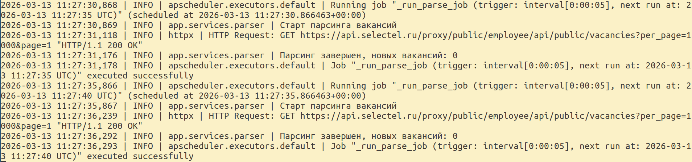

## Решение

Было выяснено, что число минут, заданное в переменной окружения, передавалось в планировщик как число секунд.
Чтобы число секунд считалось верно, было добавлено домножение числа минут на 60.

# Ошибка 5: неверное время логирования в контейнерах

Состояние:
```
commit 84921f1
```

## Действия
```bash
podman-compose up --build
```

## Проблема
Как можно видеть на следующем рисунке, время логов считается как GMT, а не GMT+3 (Москва, local time).
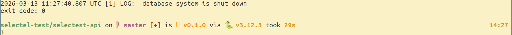

## Решение

В `docker-compose` была добавлена переменная окружения `TZ=Europe/Moscow`.

# Ошибка 6: ответ "200 OK" при добавлении значения с повторяющимся `external_id`

Состояние:
```
commit fa96157
```

## Действия
```bash
podman-compose up --build
```

Далее была выполнена двукратная посылка запроса POST на создание вакансии со значением по умолчанию.

## Проблема

Был получен ответ "200 OK" при добавлении значения с повторяющимся `external_id`.
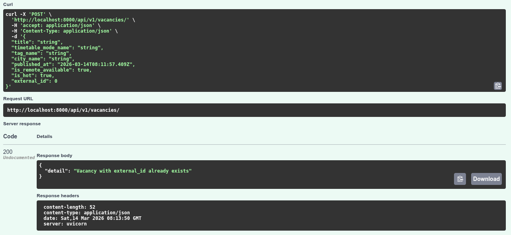

## Решение

```diff
--- a/selectest-api/app/api/v1/vacancies.py
+++ b/selectest-api/app/api/v1/vacancies.py
@@ -1,3 +1,4 @@
+from inspect import currentframe, getframeinfo
 from typing import List, Optional
 
 from fastapi import APIRouter, Depends, HTTPException, status
@@ -45,13 +46,26 @@ async def get_vacancy_endpoint(
 @router.post("/", response_model=VacancyRead, status_code=status.HTTP_201_CREATED)
 async def create_vacancy_endpoint(
     payload: VacancyCreate, session: AsyncSession = Depends(get_session)
-) -> VacancyRead:
+) -> VacancyRead | JSONResponse:
     if payload.external_id is not None:
         existing = await get_vacancy_by_external_id(session, payload.external_id)
         if existing:
             return JSONResponse(
-                status_code=status.HTTP_200_OK,
-                content={"detail": "Vacancy with external_id already exists"},
+                status_code=status.HTTP_422_UNPROCESSABLE_CONTENT,
+                content={
+                    "detail": {
+                        "loc": [
+                            __file__,
+                            (
+                                getframeinfo(frame).lineno
+                                if (frame := currentframe())
+                                else ""
+                            ),
+                        ],
+                        "msg": "Vacancy with external_id already exists",
+                        "type": "Already Exists",
+                    }
+                },
             )
     return await create_vacancy(session, payload)
```

# Ошибка 7: ответ "500 Internal Server Error" при обновлении значения на занятый `external_id`

Состояние:
```
commit fa96157
```

## Действия
```bash
podman-compose up --build
```

Далее была выполнена двукратная посылка запроса POST на создание вакансии со значением по умолчанию, где в поле `external_id` были изменены значения на два различных, к примеру, 0 и 1.
Далее было выполнено обновление запросом PUT последней созданной вакансии с `"external_id":1` таким образом, чтобы новое `external_id` совпадало с уже существующим, в данном случае было установлено значение `"external_id": 0`.

## Проблема

Был получен ответ "500 Internal Server Error" при добавлении значения с повторяющимся `external_id`.
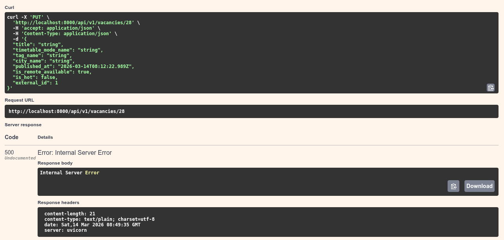

## Решение

```diff
--- a/selectest-api/app/api/v1/vacancies.py
+++ b/selectest-api/app/api/v1/vacancies.py
@@ -75,11 +75,31 @@ async def update_vacancy_endpoint(
     vacancy_id: int,
     payload: VacancyUpdate,
     session: AsyncSession = Depends(get_session),
-) -> VacancyRead:
+) -> VacancyRead | JSONResponse:
     vacancy = await get_vacancy(session, vacancy_id)
     if not vacancy:
         raise HTTPException(status_code=status.HTTP_404_NOT_FOUND, detail="Not found")
-    return await update_vacancy(session, vacancy, payload)
+    try:
+        vacancy_result = await update_vacancy(session, vacancy, payload)
+    except Exception as e:
+        return JSONResponse(
+            status_code=status.HTTP_422_UNPROCESSABLE_CONTENT,
+            content={
+                "detail": {
+                    "loc": [
+                        __file__,
+                        (
+                            getframeinfo(frame).lineno
+                            if (frame := currentframe())
+                            else ""
+                        ),
+                    ],
+                    "msg": "Vacancy with external_id already exists",
+                    "type": "Already Exists",
+                }
+            },
+        )
+    return vacancy_result
```

# Итог

- Все эндпоинты работают корректно, насколько удалось выяснить.
- Приложение возвращает корректные http-статусы и данные.

Скриншоты Swagger UI приложены в файле `Selectel Vacancies API - Swagger UI.pdf` и также в следующем разделе.

# Снимки экрана

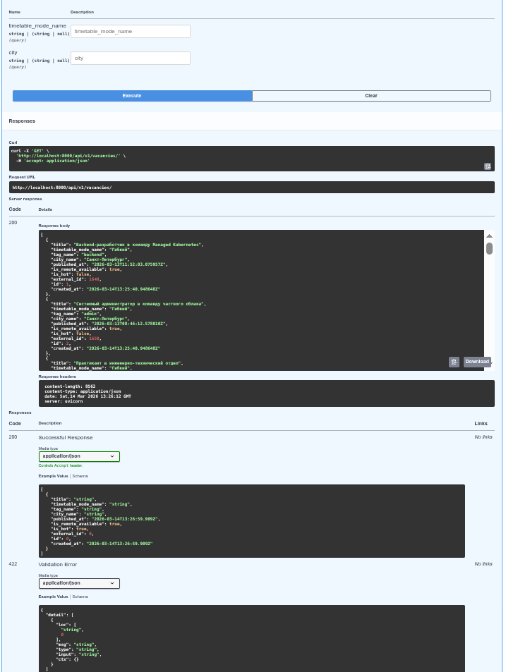
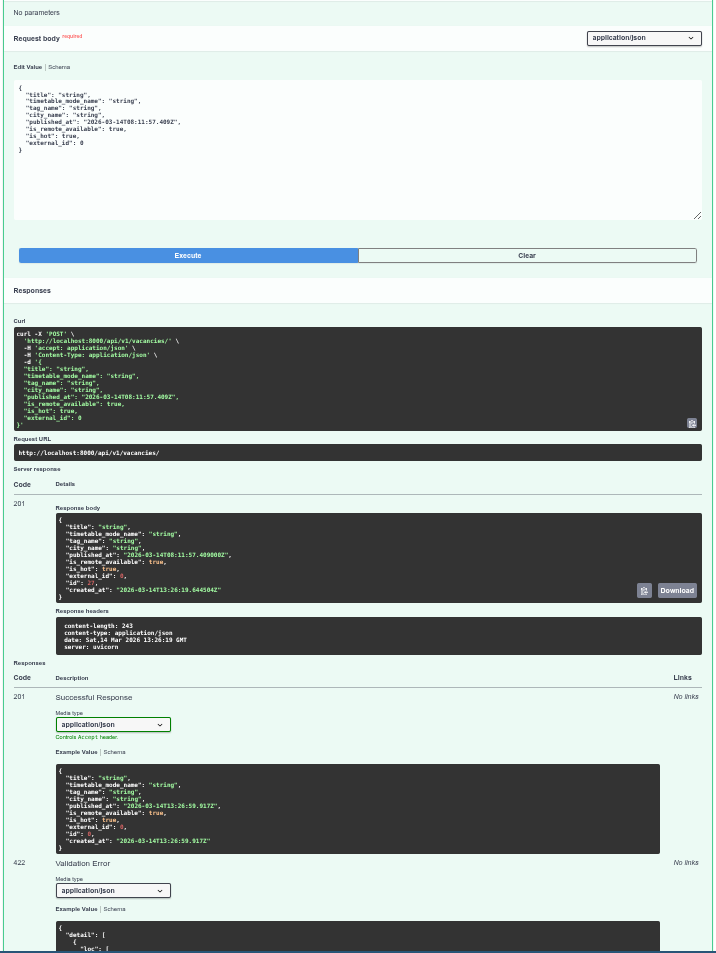
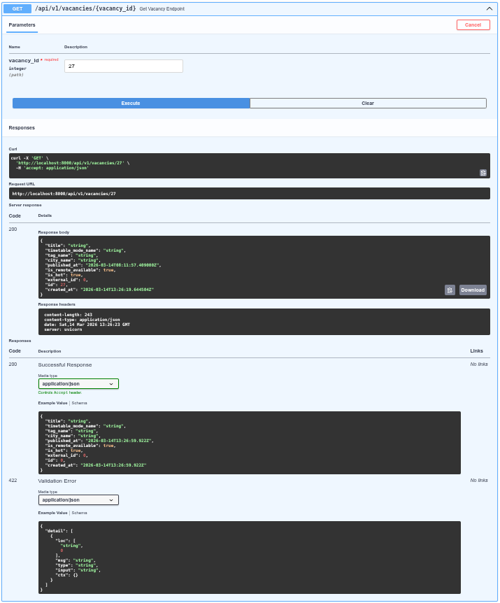
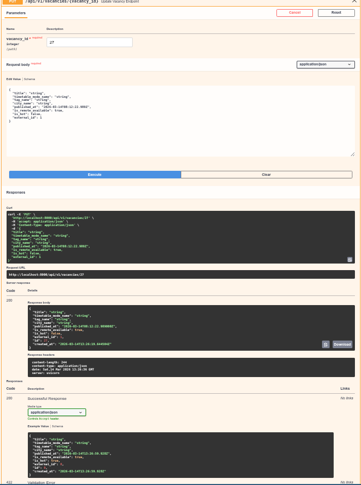
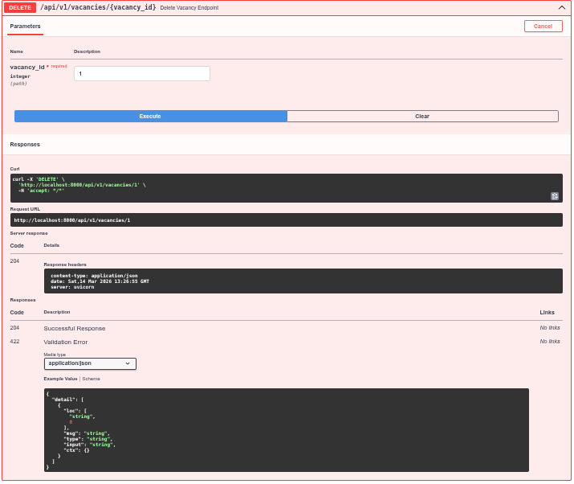
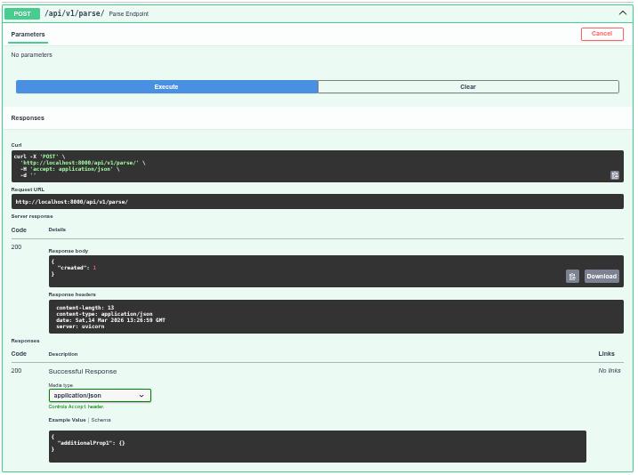
